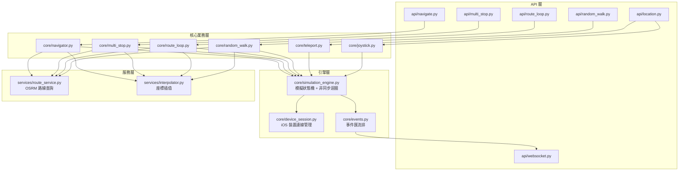
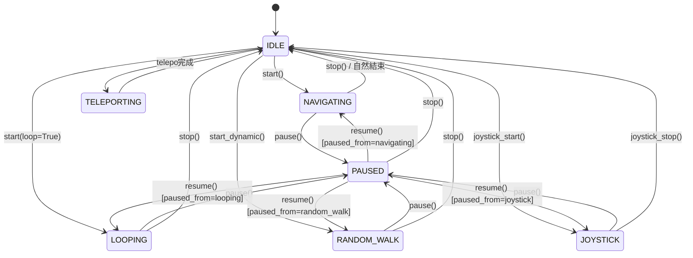

# ArcWayfarer 架構合約文件

> **⚠️ 改程式之前，先讀這份文件。**
>
> 這份文件定義了系統的模組邊界、資料流向、關鍵不變量、以及改動影響範圍。
> 違反這些規則就是 bug 的來源。

---

## 目錄

1. [系統架構總覽](#1-系統架構總覽)
2. [模組依賴圖](#2-模組依賴圖)
3. [關鍵資料流](#3-關鍵資料流)
4. [前端模組合約](#4-前端模組合約)
5. [後端模組合約](#5-後端模組合約)
6. [🔴 關鍵不變量（不能違反的規則）](#6--關鍵不變量不能違反的規則)
7. [🟡 改動影響矩陣（改了 A 必須檢查 B）](#7--改動影響矩陣改了-a-必須檢查-b)
8. [狀態管理地圖](#8-狀態管理地圖)
9. [API 合約速查表](#9-api-合約速查表)
10. [設備管理重構文件](#10-設備管理重構文件)

---

## 1. 系統架構總覽

```
┌─────────────────────────────────────────────────────────────────┐
│                        使用者操作                                │
│   地圖點擊 │ 文字輸入 │ 貼上座標 │ GPX 匯入 │ 搖桿 │ 右鍵選單    │
└──────┬──────────┬──────────┬──────────┬──────────┬──────────┬───┘
       │          │          │          │          │          │
       ▼          ▼          ▼          ▼          ▼          ▼
┌─────────────────────────────────────────────────────────────────┐
│                     前端 (React 18 + Vite)                      │
│                                                                 │
│  ┌──────────┐  ┌──────────┐  ┌──────────┐  ┌──────────────┐   │
│  │ coords.ts│  │  gpx.ts  │  │useWaypoint│  │ Panel 元件群  │   │
│  │ 座標解析  │  │ GPX 解析 │  │  List.ts  │  │ (6 種模式)   │   │
│  │ 進度計算  │  │          │  │ 路點管理   │  │              │   │
│  └────┬─────┘  └────┬─────┘  └────┬─────┘  └──────┬───────┘   │
│       │             │             │               │             │
│       └─────────────┴─────────────┴───────────────┘             │
│                           │                                     │
│                    REST API 呼叫                                │
│                           │                                     │
│  ┌────────────────────────┼────────────────────────────────┐    │
│  │   useWebSocket.ts      │         MapView               │    │
│  │   即時位置接收          │    Leaflet / MapLibre         │    │
│  │                        │    路線繪製 + 動畫箭頭         │    │
│  └────────┬───────────────┼────────────────────────────────┘    │
│           │               │                                     │
│    WebSocket 接收    ActiveFlightHUD                             │
│    positions/states  進度條 + ETA                                │
└───────────┬───────────────┬─────────────────────────────────────┘
            │               │
     ═══════╪═══════════════╪═══════ HTTP + WebSocket 邊界 ═══════
            │               │
┌───────────┴───────────────┴─────────────────────────────────────┐
│                   後端 (Python FastAPI)                          │
│                                                                 │
│  ┌──────────┐  ┌──────────────┐  ┌──────────────────────────┐  │
│  │ API 路由  │  │ route_service│  │   interpolator.py       │  │
│  │ (FastAPI) │→ │  OSRM 路線  │→ │  等距插值 (tick 座標)    │  │
│  └──────────┘  └──────────────┘  └────────────┬─────────────┘  │
│                                               │                 │
│  ┌──────────────────────┐    ┌────────────────┴──────────────┐ │
│  │   multi_stop.py      │    │   simulation_engine.py        │ │
│  │   route_loop.py      │───▶│   模擬迴圈 + 狀態機           │ │
│  │   navigator.py       │    │   _run / _run_jump / joystick │ │
│  └──────────────────────┘    └────────────────┬──────────────┘ │
│                                               │                 │
│                              ┌────────────────┴──────────────┐ │
│                              │   device_session.py           │ │
│                              │   pymobiledevice3 寫入 GPS    │ │
│                              └───────────────────────────────┘ │
└─────────────────────────────────────────────────────────────────┘
```

---

## 2. 模組依賴圖

### 2.1 前端依賴鏈

```mermaid
graph TD
    subgraph 純函數層（無副作用）
        coords["coords.ts<br/>座標解析 / 進度計算 / 測地線"]
        gpx["gpx.ts<br/>GPX XML 解析"]
        physics["joystickPhysics.ts<br/>搖桿響應曲線"]
    end

    subgraph Hooks 層（React 狀態）
        useWP["useWaypointList<br/>路點增刪排序"]
        useWS["useWebSocket<br/>即時位置接收"]
        useJC["useJoystickConfig<br/>搖桿設定"]
        useJK["useJoystickKeyboard<br/>鍵盤搖桿"]
        usePS["usePlaceSearch<br/>地點搜尋"]
        useFav["useFavorites<br/>收藏管理"]
    end

    subgraph 服務層（HTTP / 快取）
        api["api.ts<br/>REST 呼叫"]
        geo["geocoding.ts<br/>Nominatim 搜尋"]
        tile["tileCacheService.ts<br/>L1+L2 圖磚快取"]
    end

    subgraph 元件層（UI 渲染）
        panels["模式面板群<br/>Teleport / Navigate / MultiStop<br/>RouteLoop / RandomWalk / Joystick"]
        map["MapView<br/>Leaflet / MapLibre"]
        hud["ActiveFlightHUD<br/>進度條 + ETA"]
    end

    useWP --> coords
    useJK --> physics
    panels --> useWP
    panels --> api
    panels --> coords
    panels --> gpx
    hud --> coords
    map --> coords
    map --> tile
    usePS --> geo
```

### 2.2 後端依賴鏈



---

## 3. 關鍵資料流

### 3.1 路線建立流（使用者按下「開始」到路線顯示在地圖上）

```
使用者輸入 waypoints
    │
    ▼
前端 Panel 呼叫 api.startMultiStop(udid, navMode, waypoints, ...)
    │
    ▼
後端 POST /api/multi-stop/start
    │
    ▼
core/multi_stop.py:
    1. 對每對相鄰 waypoint 呼叫 route_service.fetch_route()
    2. OSRM 回傳道路幾何 polyline [(lat,lng), ...]
    3. 對每段 leg 呼叫 interpolator.interpolate(points, speed_mps, tick_seconds=1.0)
    4. ⚠️ 後續 leg 的第一個點被切掉: leg_playback[1:]（避免重複）
    5. 串接所有 leg 成完整 playback 陣列
    6. 記錄 station_indices（各站到達的 tick 索引）和 stop_at（tick→站號對應）
    7. 呼叫 simulation_engine.start(udid, playback, tick_seconds, speed_mps, ...)
    │
    ▼
回傳 { status: "ok", route: LatLng[], legs: LatLng[][] }
    │
    ▼
前端收到 response:
    1. 設定 overlay.path = route（完整路線繪製在地圖上）
    2. 儲存 legs 到 sessionStorage
    3. 開始接收 WebSocket position 更新
```

### 3.2 模擬執行流（backend 驅動 GPS 每秒移動）

```
simulation_engine.start() 啟動 asyncio.Task
    │
    ▼
_run() 迴圈:
    for idx, (lat, lng) in enumerate(points):
        │
        ├─ await session.pause_event.wait()  ← 暫停時在這裡阻塞
        │
        ├─ await device_session.set_location(udid, lat, lng)  ← 寫入 iOS GPS
        │
        ├─ await events.emit_position(udid, lat, lng, speed, eta, stop)
        │       │
        │       └─▶ WebSocket broadcast → 前端 useWebSocket 接收
        │                                      │
        │                                      ├─ positions[udid] 更新
        │                                      ├─ ActiveFlightHUD 重算進度
        │                                      └─ MapView 移動即時標記
        │
        ├─ await asyncio.sleep(tick_seconds)  ← 固定 1.0 秒間隔
        │
        └─ if idx in station_indices:
               await asyncio.sleep(random(pause_min, pause_max))  ← 站點暫停
```

### 3.3 前端進度計算流

```
WebSocket 收到新的 position { lat, lng, stopIndex }
    │
    ▼
ActiveFlightHUD 呼叫 calculateRouteProgressPct():
    │
    ├─ 取得 activePath = routeLegForStop(routePath, waypoints, stopIndex, isLoop)
    │       │
    │       └─ ⚠️ 在 routePath 中找到最接近 waypoints[stopIndex] 的點
    │          然後截取到 waypoints[stopIndex+1] 的子路徑
    │
    ├─ 計算 activePath 的總距離（haversine 累加）
    │
    ├─ 將 livePosition 投影到最近的線段:
    │       t = clamp( dot(AP, AB) / |AB|², 0, 1 )
    │       projectedDistance = 累積距離 + t × 該線段長度
    │
    └─ 回傳 percentage = projectedDistance / totalDistance × 100
            │
            ▼
        HUD 進度條更新
        地圖上的 activePath 高亮更新
        動畫箭頭沿 activePath 播放
```

---

## 4. 前端模組合約

### 4.1 `coords.ts` — 座標工具函數

| 函數 | 輸入 | 輸出 | 用途 |
|---|---|---|---|
| `parsePoint(text)` | 字串 | `LatLng \| null` | 解析各種座標格式 |
| `parsePastedPoints(text)` | 多行字串 | `{ points, invalidCount }` | 批次貼上座標 |
| `formatPoint(point)` | `LatLng \| null` | 字串 `"lat,lng"` | 顯示用格式化 |
| `formatEta(seconds)` | 秒數 | `"MM:SS"` | ETA 顯示 |
| `haversineDistanceKm(a, b)` | 兩點 | 公里數 | 球面距離 |
| `movePoint(center, bearing, dist)` | 起點+方位+距離 | `LatLng` | 測地線平移 |
| `pointsOnCircle(center, radius, count)` | 圓心+半徑+數量 | `LatLng[]` | 圓形路點產生 |
| `routeLegForStop(route, waypoints, stop, isLoop)` | 路線+站點資訊 | `LatLng[] \| null` | 取得當前行駛中的子路段 |
| `calculateRouteProgressPct(...)` | 路線+即時位置+站號 | `0~100` 百分比 | HUD 進度計算 |

**這個檔案的規則：**
- 所有函數都是**純函數**，不能加入任何 React state 或 side effect
- 座標驗證範圍：lat ∈ [-90, 90], lng ∈ [-180, 180]
- 地球半徑常數：6371 km（haversine）/ 6,371,000 m（movePoint）
- `routeLegForStop` 在 `routePath < 2 點`時，退化為 waypoint 直線連接

### 4.2 `useWaypointList.ts` — 路點管理 Hook

**職責邊界：** 只管理路點的增刪改查排序，**不負責**呼叫 API 或繪製地圖。

| 方法 | 行為 |
|---|---|
| `updateWaypoint(idx, point)` | 地圖點擊時自動填充第一個空白欄位 |
| `handleTextChange(idx, text)` | 文字輸入時即時解析座標 |
| `addWaypoint()` | 在最末尾新增空白路點 |
| `insertWaypointAfter(idx)` | 在指定位置之後插入 |
| `removeWaypoint(idx)` | 移除指定路點 |
| `moveWaypoint(from, to)` | 拖曳排序 |
| `reverseWaypoints()` | 反轉路點順序 |
| `setAsStart(idx)` | 循環旋轉陣列，讓指定路點成為起點 |
| `clearAllWaypoints()` | 清空並恢復初始 2 個空白欄位 |
| `setAllWaypoints(points)` | 從外部整批設定（GPX 匯入、收藏載入） |

**這個 Hook 的規則：**
- 每個路點有 `crypto.randomUUID()` 產生的唯一 ID（dnd-kit 排序依賴此 ID）
- `updateWaypoint` 被地圖點擊呼叫時，**先填空欄再追加**
- `validWaypoints` 是衍生值，只包含 `point !== null` 的路點

### 4.3 `useWebSocket.ts` — 即時通訊

**職責邊界：** 只管理 WebSocket 連線和資料分發，不做任何業務邏輯。

| 輸出 | 型別 | 說明 |
|---|---|---|
| `connected` | `boolean` | 連線狀態 |
| `positions` | `Record<udid, LivePosition>` | 各裝置即時座標 |
| `states` | `Record<udid, DeviceState>` | 各裝置模擬狀態 |
| `send(type, data, udid?)` | function | 發送訊息（搖桿輸入） |

**這個 Hook 的規則：**
- 自動重連，退避策略：min(1000 × 2^attempt, 30000) ms
- 收到 `lat === null` 時**移除**該裝置的 position（模擬結束）
- Mobile 模式自動發送 auth 握手

### 4.4 MapView 元件 — 地圖渲染

**職責邊界：** 接收 `MapOverlay` 資料並渲染，不處理業務邏輯。

| 輸入 | 說明 |
|---|---|
| `overlay.path` | 完整路線 polyline |
| `overlay.activePath` | 當前行駛中的子路段（高亮顯示） |
| `overlay.markers` | 路點標記 |
| `overlay.circle` | 隨機漫步圓形範圍 |
| `livePosition` | 即時位置標記 |

**動畫箭頭規則：**
- 沿 `activePath` 每 180m 放置一個方向箭頭
- 動畫週期：10 秒（2500ms × 4）
- 使用 `requestAnimationFrame` 驅動，必須在 cleanup 時取消

---

## 5. 後端模組合約

### 5.1 `interpolator.py` — 座標插值器

```python
interpolate(points, speed_mps, tick_seconds) -> list[(lat, lng)]
```

| 參數 | 意義 | 預設/限制 |
|---|---|---|
| `points` | 原始路線座標 | 至少 2 個點 |
| `speed_mps` | 移動速度 (m/s) | walk=1.389, bike=5.25, drive=11.111 |
| `tick_seconds` | 採樣間隔 | 固定 1.0 秒 |
| **回傳** | 等距採樣的 tick 座標 | 最後一點保證是 `points[-1]` |

**不變量：** step_m = speed_mps × tick_seconds，跨線段時攜帶殘餘距離。

### 5.2 `simulation_engine.py` — 模擬狀態機

**狀態轉移圖：**



**關鍵規則：**
- 每個裝置（udid）只能有**一個** active asyncio.Task
- `start()` 會先 `ensure_stopped()` 殺掉既有任務
- 暫停透過 `asyncio.Event.clear()` 實現，`_run` 迴圈在 `pause_event.wait()` 阻塞
- 暫停狀態攜帶 `paused_from` 子狀態（如 `paused:navigating`）
- `asyncio.Lock` 保證同一裝置不會同時有兩個狀態轉換

### 5.3 `multi_stop.py` / `route_loop.py` — 多站路線

**multi_stop 流程：**
```
N 個 waypoints → N-1 條 leg（開放路線）
每條 leg: fetch_route() → interpolate() → playback 座標
後續 leg 的第一個座標被切掉 [1:]（避免重複）
station_indices = 各站到達的 tick 索引
stop_at = { tick_idx: waypoint_number }（1-based）
最後一站不暫停
```

**route_loop 流程：**
```
N 個 waypoints → N 條 leg（閉合迴圈，最後一條是 WP[N-1] → WP[0]）
其餘同 multi_stop
simulation_engine.start(loop=True) 會無限循環
```

### 5.4 `device_session.py` — iOS 裝置連線

**規則：**
- iOS 17+ 使用 DVT Instruments（需要保持連線 context manager 開啟）
- iOS 16 以下使用 Lockdown DtSimulateLocation
- 自動 3 次重試，失敗時拆掉 session 重建
- 每個 udid 有獨立的 `asyncio.Lock` 保護並發

### 5.5 設備管理 — 目標模組邊界

> 本節是已接受的目標架構。遷移期間舊 `device_manager.py` 與新模組會依 strangler 路線短暫並存；不得因此放寬下列邊界。

| 模組 | 唯一責任 | 禁止事項 |
|---|---|---|
| `discovery/*_scanner.py` | 回報 USB、系統 Wi-Fi 與 Direct 端點的 immutable snapshot | 不得建立、切換或關閉 transport |
| `device_registry.py` | 保存每台設備的 aggregate、revision 與最新觀測 | 不得直接操作 socket 或 tunnel |
| `route_policy.py` | 以純函式計算唯一 `selected_route` | 不得 I/O 或修改 registry |
| `transport_controller.py` | 建立、切換與關閉 transport | 只接受 command、Registry policy effect、session failure 或 shutdown；不得由 GET 或 scanner 直接呼叫 |
| `pairing_manager.py` | 建立、驗證、刷新及刪除配對能力 | 不得把已配對視為已連線 |
| `device_session.py` | 維護定位 session 及其 `bound_route` | 不得反向查詢並改寫 manager 全域狀態 |

設備內部狀態必須分開保存 `availability`、`direct_runtime`、`authorization`、`user_intent`、`selected_route`、`session` 與 `revision`。USB、系統 Wi-Fi 與 Direct 候選端點可同時被觀測到；active Direct 的 runtime 健康只能由 Transport Controller 或實際 session I/O 更新。對外清單只能顯示 policy 算出的單一 `selected_route`。

---

## 6. 🔴 關鍵不變量（不能違反的規則）

> **以下每一條規則都是從 bug 中學到的。違反任何一條都會導致功能壞掉。**

### 座標與幾何

| # | 規則 | 違反後果 |
|---|---|---|
| C1 | lat ∈ [-90, 90], lng ∈ [-180, 180] | OSRM 路線查詢失敗 |
| C2 | haversine 使用弧度計算，結果單位是 km | 距離計算錯 10⁴ 倍 |
| C3 | `calculateRouteProgressPct` 中，零長度線段必須跳過（避免除以零） | HUD 顯示 NaN |
| C4 | `routeLegForStop` 在 routePath 不足 2 點時退化為直線 | 程式崩潰 |
| C5 | `movePoint` 使用 6,371,000m 為地球半徑 | 搖桿位移距離錯誤 |

### 路線插值

| # | 規則 | 違反後果 |
|---|---|---|
| I1 | tick_seconds 固定為 1.0，不能隨意改 | ETA 計算全部失準 |
| I2 | step_m = speed_mps × tick_seconds | 速度顯示與實際移動不符 |
| I3 | 插值結果的最後一個點**必須**是原始路線的終點 | 永遠到不了目的地 |
| I4 | 後續 leg 的第一個插值點必須被切掉 `[1:]` | 在銜接處出現重複暫停或閃爍 |
| I5 | `stop_at` 的 waypoint number 是 **1-based** | 站號錯位，HUD 顯示錯誤站 |

### 模擬引擎

| # | 規則 | 違反後果 |
|---|---|---|
| S1 | 每個 udid 同時只能有一個 active asyncio.Task | 兩個迴圈同時寫 GPS，座標跳動 |
| S2 | `start()` 必須先呼叫 `ensure_stopped()` | 孤立的背景任務不斷發送座標 |
| S3 | 暫停使用 `pause_event.clear()`，恢復用 `pause_event.set()` | 暫停失效或永遠卡住 |
| S4 | 狀態變更必須透過 `set_state()` 並發射 `emit_state_change` | 前端狀態不同步，按鈕顯示錯誤 |
| S5 | `_run` 結束時必須 `set_state(IDLE)` 並 `emit_position(lat=None)` | 前端永遠顯示「導航中」 |

### 前後端通訊

| # | 規則 | 違反後果 |
|---|---|---|
| W1 | WebSocket position 的 lat=null 代表模擬結束 | 前端殘留舊位置標記 |
| W2 | WebSocket state 格式：`"paused:navigating"` 帶冒號子狀態 | 前端無法正確判斷暫停來源 |
| W3 | REST 回傳的 `route` 和 `legs` 座標格式是 `{lat, lng}` | 地圖繪製錯誤 |
| W4 | `legs` 陣列的順序對應 waypoints 的順序 | activePath 高亮錯誤路段 |

### 前端渲染與圖層層級 (Z-Index Contract)

| # | 規則 | 違反後果 |
|---|---|---|
| R1 | `requestAnimationFrame` 必須在 cleanup / unmount 時取消 | 記憶體洩漏，殘留動畫 |
| R2 | Leaflet layer 必須在 useEffect cleanup 時移除 | 切換模式後殘留路線 |
| R3 | `sessionStorage` 的 key 包含 deviceId | 多裝置時路線串台 |
| R4 | overlay 更新時必須整包替換 `setOverlay({...})` | 舊的 markers/path 殘留 |
| R5 | **全域浮動操控工具（如 `.joystick-float-dock`）z-index 必須 ≥ 1200** | 在 Leaflet 模式下被地圖 Pane (z:400~1000) 遮擋消失 |
| R6 | **常駐 UI 覆蓋層（如面板、狀態列）z-index 必須維持在 450 ~ 1199 區間** | 面板被地圖路線覆蓋或反向遮擋浮動控制項 |
| R7 | **系統級彈窗（Modals）z-index 必須 ≥ 2000，通知 Toast 必須 ≥ 9000** | 彈窗無法完全遮蓋浮動搖桿或通知被彈窗遮擋 |

### 設備管理與傳輸路由

| # | 規則 | 違反後果 |
|---|---|---|
| D1 | 一次成功 discovery snapshot 掃描不到的裝置不得出現在即時清單；掃描失敗不得當成空結果 | 幽靈裝置或整批設備誤消失 |
| D2 | 每個顯示中的裝置必須只有一個 `selected_route`：USB、Wi-Fi、Wireless Direct 三者之一 | Badge 與實際路由不一致 |
| D3 | 配對紀錄只表示 authorization，不代表已連線或可操作 | 歷史紀錄被誤當在線設備 |
| D4 | 掃描可回報 Direct 候選端點，但不得判定 active Direct 失效，也不得建立、啟用、停用或關閉 Direct；runtime 健康只由 Transport Controller／session I/O 更新 | 背景輪詢破壞使用者選擇 |
| D5 | Active session 必須 pin 在 `bound_route`；背景掃描或新 transport 出現不得替換它 | 導航或定位途中斷線 |
| D6 | 一台設備的 command、失敗或清理不得修改另一台設備的 route、tunnel 或 session | 多設備互相誤殺 |
| D7 | `GET /api/devices` 與其他查詢不得關閉任何 transport | 讀取操作造成斷線 |
| D8 | 每個 discovery source 必須回報 `success` 或 `failed`；只有成功空結果可表示未發現設備 | 服務故障被誤判為設備離線 |
| D9 | tunneld-only 只能記錄 observed source；不得在 discovery 層直接推論為 USB 或 Wi-Fi | 顯示錯誤 transport |
| D10 | Wireless Direct 只能由使用者顯式啟用並保持黏著；只可因顯式中斷、閒置時 USB 接管或實際傳輸失敗而改變 | Direct 自動復活或被掃描搶走 |

#### 全域圖層層級架構速查 (Z-Index Tiers)
```
Tier 5 (9000+)       : 系統通知 (Mantine Toasts / Notifications)
Tier 4 (2000 ~ 4999) : 系統彈窗與指令面板 (.modal-backdrop, CommandPalette)
Tier 3 (1200 ~ 1999) : 全域浮動操控工具 (.joystick-float-dock: 1200, ContextMenu: 1500)
Tier 2 (450 ~ 1199)  : 常駐 UI 覆蓋層 (.overlay-panel-dock: 450, .overlay-top-center: 500, map-engine: 999)
Tier 1 (0 ~ 699)     : 地圖內部渲染 (Tiles: 0, RouteLine: 410, Arrow: 420, Selected: 625, Live: 650)
```

---

## 7. 🟡 改動影響矩陣（改了 A 必須檢查 B）

> **在動手改程式之前，先查這張表。**

### 改前端

| 如果你改了... | 必須同時檢查... |
|---|---|
| `coords.ts` 的任何函數 | ✅ ActiveFlightHUD 進度是否正常<br/>✅ MapView 的 activePath 高亮是否正確<br/>✅ 動畫箭頭方向是否正確<br/>✅ 所有面板的座標顯示 |
| `useWaypointList.ts` | ✅ 所有面板（MultiStop, RouteLoop, Navigate）的路點操作<br/>✅ 拖曳排序<br/>✅ GPX 匯入<br/>✅ 貼上座標<br/>✅ 右鍵選單「設為起點」 |
| `useWebSocket.ts` | ✅ 即時位置標記是否更新<br/>✅ HUD ETA 是否更新<br/>✅ 搖桿輸入是否送出<br/>✅ 多裝置切換時位置是否正確<br/>✅ Mobile Remote 連線 |
| `api.ts` 的請求函數 | ✅ 對應的後端 API 端點參數是否匹配<br/>✅ 回傳值的型別是否正確處理 |
| 任何 Panel 元件 | ✅ overlay 設定是否完整（markers + path + activePath + circle）<br/>✅ sessionStorage 是否正確存取<br/>✅ 開始/暫停/恢復/停止全流程 |
| MapView (Leaflet 或 MapLibre) | ✅ 另一個 MapView 是否也需要同步改動<br/>✅ 動畫 cleanup 是否正確<br/>✅ light/dark 圖磚切換 |
| `types.ts` 的型別定義 | ✅ 所有引用該型別的元件<br/>✅ 後端 schemas.py 是否同步 |

### 改後端

| 如果你改了... | 必須同時檢查... |
|---|---|
| `interpolator.py` | ✅ navigate、multi_stop、route_loop、random_walk 全部模式<br/>✅ ETA 計算是否正確<br/>✅ 最後一個點是否仍然是終點 |
| `simulation_engine.py` | ✅ 所有模式的 start/stop/pause/resume<br/>✅ 狀態轉移是否正確<br/>✅ WebSocket 事件是否正確發射<br/>✅ 快速連點 start/stop 不會產生孤立任務 |
| `multi_stop.py` | ✅ `leg_playback[1:]` 切割是否正確<br/>✅ station_indices 是否對齊<br/>✅ stop_at 是否 1-based<br/>✅ jump_mode 是否仍然正常 |
| `route_loop.py` | ✅ 閉合路線（最後一條 leg 回到起點）<br/>✅ 無限循環播放<br/>✅ station_indices 是否包含回程 |
| `route_service.py` | ✅ 座標格式 (lat,lng) vs (lng,lat) 轉換<br/>✅ straight_line 退化路線<br/>✅ OSRM 失敗時的 fallback |
| `device_session.py` | ✅ iOS 17+ DVT 和 iOS 16 Lockdown 兩條路徑<br/>✅ 重試邏輯<br/>✅ session 清理 |
| 設備 discovery / `GET /api/devices` | ✅ 查詢沒有關閉任何 transport<br/>✅ source failure 與成功空結果分開<br/>✅ active session 的 route 未改變 |
| route policy / selected route | ✅ USB、Wi-Fi、Direct 同時可用的組合表<br/>✅ session pinning<br/>✅ 僅顯式操作能啟用 Direct |
| Direct connect / disconnect | ✅ 只修改目標 UDID<br/>✅ connect 後 revision 遞增<br/>✅ 舊 scan 不得覆蓋新結果 |
| `events.py` | ✅ WebSocket 廣播是否正確<br/>✅ 前端 useWebSocket 是否正確接收 |
| `schemas.py` (Pydantic models) | ✅ 前端 api.ts 的對應請求/回應是否同步<br/>✅ 欄位驗證範圍 |
| `config.py` 的常數 | ✅ NAV_MODE_SPEED_MPS 改了會影響所有模式速度<br/>✅ NAVIGATE_TICK_SECONDS 改了會影響 ETA 和插值 |

---

## 8. 狀態管理地圖

### 8.1 App.tsx 根元件狀態

| 狀態 | 型別 | 來源 | 說明 |
|---|---|---|---|
| `focusedDeviceId` | `string \| null` | 使用者切換 | 目前操作中的裝置 |
| `modeByDevice` | `Record<udid, Mode>` | 使用者切換 | 每裝置的操作模式 |
| `overlaysByDevice` | `Record<udid, MapOverlay>` | Panel 元件設定 | 每裝置的地圖覆蓋層 |
| `pointByDevice` | `Record<udid, LatLng>` | Panel 元件設定 | 每裝置的焦點座標 |
| `positions` | `Record<udid, LivePosition>` | WebSocket | 即時位置 |
| `states` | `Record<udid, DeviceState>` | WebSocket | 裝置模擬狀態 |

### 8.2 持久化機制

| 儲存位置 | Key 格式 | 內容 | 生命週期 |
|---|---|---|---|
| `sessionStorage` | `arcwayfarer.navigate.${deviceId}` | 當前路線 + waypoints | 分頁關閉即清除 |
| `localStorage` | `arcwayfarer.map_engine` | `leaflet \| maplibre` | 永久 |
| `localStorage` | `arcwayfarer.joystick_config` | 搖桿設定 | 永久 |
| `localStorage` | `arcwayfarer.lang` | 語言 | 永久 |
| `~/.arcwayfarer/*.json` | - | 收藏/歷史/路線 | 永久（後端管理） |

### 8.3 設備管理狀態（目標）

| 維度 | 值 | 寫入來源 |
|---|---|---|
| `availability` | USB、system Wi-Fi 與 Direct 候選端點的觀測狀態 | discovery snapshot |
| `direct_runtime` | `disconnected \| connecting \| ready \| failed` | Transport Controller／session I/O |
| `authorization` | `unpaired \| paired \| stale` | pairing manager |
| `user_intent` | `auto \| direct` | 使用者 command |
| `selected_route` | `none \| usb \| wifi \| wireless_direct` | route policy |
| `session` | `idle \| active \| stopping \| failed` + `bound_route` | session events |
| `revision` | 單調遞增整數 | registry 每次狀態變更 |

前端只能套用不早於目前 revision 的設備快照。foreground refresh 若遇到 in-flight scan，必須在舊請求完成後補跑一次，不能把舊 promise 當成連線後的新狀態。

---

## 9. API 合約速查表

### 9.1 模擬控制 API

| 端點 | 請求 | 回應 | 備註 |
|---|---|---|---|
| `POST /api/navigate/start` | `{ udid, nav_mode, start, end, custom_speed_kmh? }` | `{ status, route: LatLng[] }` | 兩點導航 |
| `POST /api/multi-stop/start` | `{ udid, nav_mode, waypoints, pause_*, straight_line?, jump_mode?, jump_*_delay?, custom_speed_kmh? }` | `{ status, route, legs }` | 多站路線 |
| `POST /api/route-loop/start` | `{ udid, nav_mode, waypoints, pause_*, straight_line?, custom_speed_kmh? }` | `{ status, route, legs }` | 循環路線 |
| `POST /api/random-walk/start` | `{ udid, nav_mode, center, radius_m, pause_*, custom_speed_kmh?, straight_line? }` | `{ status }` | 隨機漫步 |
| `POST /api/location/joystick/start` | `{ udid, nav_mode, lat, lng, custom_speed_kmh? }` | `{ status }` | 搖桿模式 |
| `POST /api/.../stop` | `{ udid }` | `{ status }` | 所有模式通用 |
| `POST /api/.../pause` | `{ udid }` | `{ status }` | 所有模式通用 |
| `POST /api/.../resume` | `{ udid }` | `{ status }` | 所有模式通用 |

### 9.2 設備管理 API 目標合約

P1／P2 遷移完成後，設備快照必須同時提供 snapshot revision、各 discovery source 的 `success | failed` 狀態，以及每台設備自己的 revision 與唯一 `selected_route`。Direct connect／disconnect command 必須回傳操作後的設備 revision；前端不得以較舊快照覆蓋它。

遷移期間可暫時保留現有陣列回應，但新舊回應必須由同一 registry snapshot 產生，禁止維護兩套路由真相。

### 9.3 WebSocket 訊息格式

**伺服器 → 前端：**
```json
// 位置更新（每秒）
{ "type": "position", "udid": "...", "lat": 25.033, "lng": 121.565, "speed_mps": 1.38, "eta_seconds": 124.0, "stop_index": 2 }

// 狀態變更
{ "type": "state", "udid": "...", "state": "navigating" }
{ "type": "state", "udid": "...", "state": "paused:navigating" }

// 模擬結束
{ "type": "position", "udid": "...", "lat": null, "lng": null, "speed_mps": 0, "eta_seconds": 0, "stop_index": null }
```

**前端 → 伺服器：**
```json
// 搖桿輸入
{ "type": "joystick_input", "udid": "...", "data": { "direction": 45.0, "intensity": 0.85 } }
```

## 10. 設備管理重構文件

- [設備管理架構決策提案](docs/device-management-architecture.zh-TW.md)：完整診斷、目標模型與 P0～P4 路線。
- [設備管理重構實作計畫](docs/device-management-implementation-plan.zh-TW.md)：PR 切分、驗收條件、回退點與 release gate。
- [ADR-0001：採用 Device Registry、Aggregate 與 Strangler 遷移](docs/adr/0001-device-management-registry.md)：決策、替代方案與後果。
- [macOS Wireless Direct 實機測試](docs/wireless-direct-macos-test.md)：平台驗證步驟與已知限制。
- [Windows Wireless Direct 實機測試](docs/wireless-direct-windows-test.md)：Windows 驗收矩陣與回報格式。

權威順序為：本文件的不變量 → ADR 決策 → 架構提案的詳細設計 → 平台測試紀錄。測試紀錄描述當時環境，不得覆蓋較新的架構合約。

---

## 附錄：檔案快速定位

| 你要找的功能 | 前端檔案 | 後端檔案 |
|---|---|---|
| 座標解析 / 進度計算 | `components/panels/coords.ts` | — |
| GPX 匯入 | `components/panels/gpx.ts` | — |
| 路點管理 | `hooks/useWaypointList.ts` | — |
| 即時位置 | `hooks/useWebSocket.ts` | `api/websocket.py`, `core/events.py` |
| 搖桿物理 | `utils/joystickPhysics.ts` | — |
| 搖桿鍵盤 | `hooks/useJoystickKeyboard.ts` | — |
| 地圖渲染 | `components/map/LeafletMapView.tsx`, `MapLibreMapView.tsx` | — |
| 進度 HUD | `components/panels/ActiveFlightHUD.tsx` | — |
| 路線查詢 | — | `services/route_service.py` |
| 座標插值 | — | `services/interpolator.py` |
| 多站路線邏輯 | — | `core/multi_stop.py` |
| 循環路線邏輯 | — | `core/route_loop.py` |
| 模擬引擎 | — | `core/simulation_engine.py` |
| 裝置連線 | `hooks/useDevices.ts`, `components/common/DeviceManagerModal.tsx` | `core/device_session.py`, `core/device_manager.py`（遷移中） |
| 設備管理目標設計 | `services/api.ts` | `core/device_registry.py`, `core/route_policy.py`, `core/transport_controller.py`（目標） |
| API 型別定義 | `services/api.ts` | `models/schemas.py` |
| 設定常數 | — | `config.py` |
