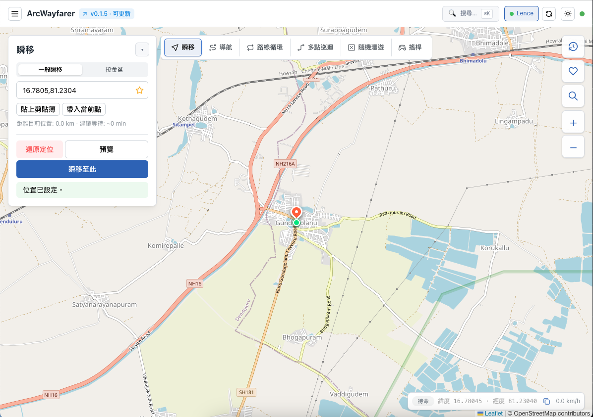

# ArcWayfarer

[繁體中文](docs/README.zh-TW.md)

**Simulate your iPhone's GPS location — on macOS and Windows.**

ArcWayfarer lets you teleport, navigate, or jog along any route on the map without physically moving. Useful for testing location-based apps, playing AR games, or protecting your real location.


<!-- TODO: replace with an actual screenshot or demo GIF -->

---

## Download

[](https://github.com/WeiYuanLee/ArcWayfarer/releases/latest)

Download the latest version from [GitHub Releases](https://github.com/WeiYuanLee/ArcWayfarer/releases/latest).

Supports **macOS** (Apple Silicon + Intel) and **Windows 10/11**.

---

## Features

### Navigation Modes

| Mode | Description |
|------|-------------|
| **Teleport** | Instantly move to any location on the map |
| **Navigate** | Walk, run, or drive along a real routed path |
| **Route Loop** | Repeat a route continuously (supports GPX / JSON import) |
| **Multi-stop** | Chain multiple waypoints in sequence with drag-to-reorder |
| **Joystick** | Control movement in real time with keyboard or on-screen pad |
| **Random Walk** | Wander randomly within a defined area |

### Other Features

| Feature | Description |
|---------|-------------|
| **Favorites** | Save, group, and drag-reorder your favorite locations |
| **History** | Browse recently visited locations |
| **Place Search** | Search for any place by name or keyword |
| **Command Palette** | Quick-access all modes, locations, and actions (⌘K) |
| **Import Routes** | Import GPX tracks or JSON waypoint files |
| **Mobile Remote** | Control the app from your phone via QR-code pairing |
| **Multi-device** | Manage multiple connected iOS devices simultaneously |
| **Auto-update** | Built-in update checker with in-app notifications |
| **macOS + Windows** | Native Electron app for both platforms |

---

## Setup

### Requirements

- **macOS** (Intel or Apple Silicon) or **Windows 10/11** (64-bit)
- iOS device connected via USB

### iOS Compatibility

- **iOS 16 and below** — Connect via USB and trust the computer. The device appears automatically, no extra steps.
- **iOS 17 and later** — ArcWayfarer handles the RemoteXPC tunnel automatically.
  - **macOS**: A system authorization dialog will appear when the tunnel starts.
  - **Windows**: The app requests Administrator privileges (UAC) at launch. iTunes or Apple Mobile Device Support must be installed.

### First Use

The first time you set a location on a device, ArcWayfarer downloads and mounts the Developer Disk Image required for developer services. This takes a few seconds to a few minutes depending on your connection — subsequent uses are instant.

---

## Opening an unsigned build

If you downloaded a build that isn't signed by an identified developer:

- **macOS**: Gatekeeper will block the app on first open. Right-click the `.app` → **Open** → confirm **Open**.
- **Windows**: SmartScreen may show an "Unknown Publisher" warning. Click **More info** → **Run anyway**.

---

## License

MIT — see [LICENSE](LICENSE).

---

<details>
<summary>Developer / build instructions</summary>

### Requirements

- Python 3.11+
- Node.js 18+ and npm

### Running in development

Backend (from `backend/`):

```bash
python3 -m venv venv
source venv/bin/activate  # Windows: .\venv\Scripts\activate
pip install -r requirements.txt
python main.py       # serves on http://127.0.0.1:8787
```

Frontend (from `frontend/`):

```bash
npm install
npm run dev           # Vite dev server on :5173
npm start             # Vite + Electron together
```

Or start everything at once:

```bash
./scripts/start.sh
./scripts/stop.sh
```

### Building for distribution

PyInstaller does **not** cross-compile — each platform must be built on its native OS.

**GitHub Actions (recommended)** — push a version tag and CI builds macOS (`arm64`, `x64`) and Windows (`x64`) installers automatically:

```bash
git tag v1.0.0
git push origin v1.0.0
```

**Local build:**

```bash
# macOS
scripts/build-mac.sh --arch arm64   # or --arch x64

# Windows
powershell scripts/build-win.ps1
```

Output lands in `frontend/release/`.

</details>
