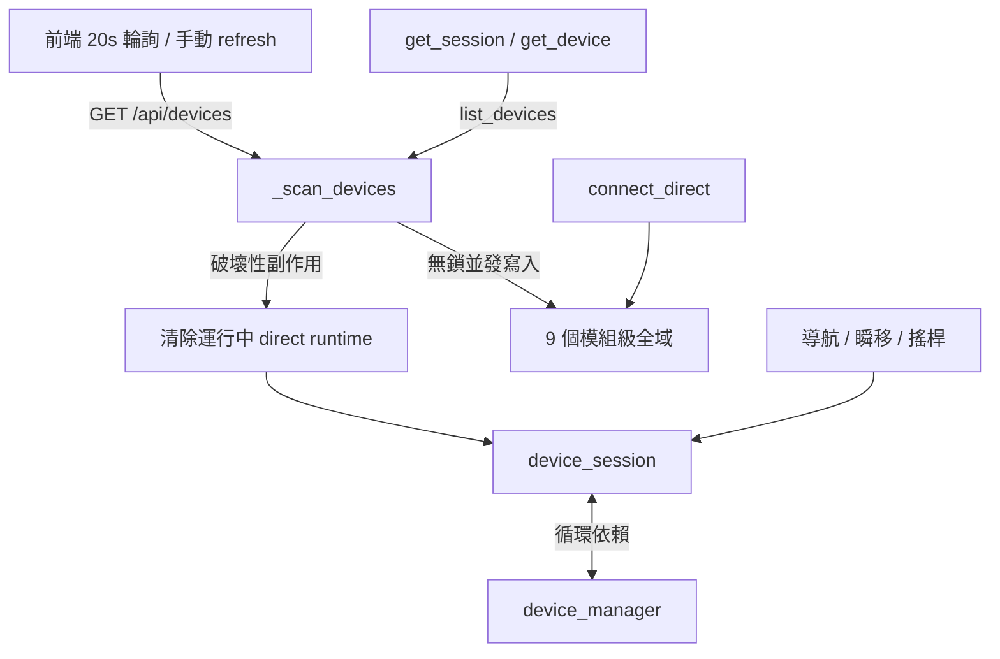
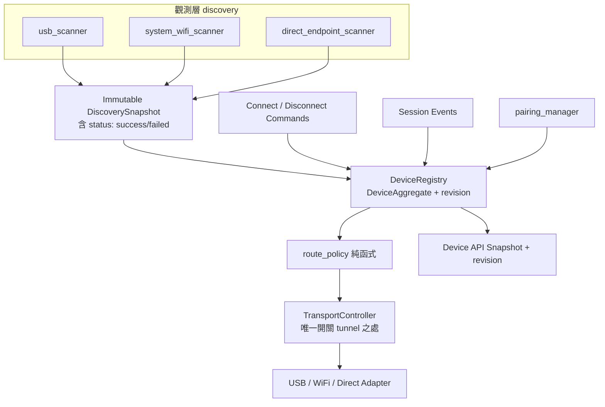

# 設備管理架構決策提案（Device Management Architecture Proposal）

> 定位：**決策提案**。內容為診斷、目標架構、分階段路線與行為契約，供拍板優先順序用，不含逐行實作規格。
>
> 目標架構：**registry + aggregate 全面重寫**（經決策拍板）。
>
> 不可退讓的護欄：**全面重寫必須以 strangler 分階段替換完成，嚴禁一次性大爆炸切換**。理由見 §7。
>
> 文件關係：本文件保存完整診斷與目標設計；根目錄 [`ARCHITECTURE.md`](../ARCHITECTURE.md) 保存必須遵守的不變量；[`ADR-0001`](adr/0001-device-management-registry.md) 保存本次決策與取捨。
>
> 實作安排：[`device-management-implementation-plan.zh-TW.md`](device-management-implementation-plan.zh-TW.md) 定義 PR 切分、驗收、回退與跨平台 release gate。

---

## 0. 一句話結論

頻繁 regression 的單一病根是：**讀取操作（掃描）會改寫傳輸狀態**，而全部狀態散落在 9 個模組級全域變數、缺少單一真相來源與正式不變量。目標是把「觀測 / 決策 / 執行」三件事徹底分離：discovery 只回報觀測、route policy 純函式決策、transport controller 是唯一能開關通道的地方。

---

## 1. 現況病根診斷（已對照原始碼查證）

以下每一條都已對重構前基線 commit `c805349` 的 `backend/core/device_manager.py`（1022 行）、`device_session.py`、`frontend/src/hooks/useDevices.ts`、`backend/tests/test_wireless_direct.py` 逐行核對。已完成項目與目前測試基線以[實作計畫](device-management-implementation-plan.zh-TW.md#實作進度2026-09-22)為準。

### 1.1 確認成立的缺陷

| 缺陷 | 位置 | 說明 |
|---|---|---|
| 掃描帶破壞性副作用 | `device_manager.py:224`、`:236-241` | USB 出現即無條件 `_clear_direct_runtime`，且**無 active session 檢查**；iOS 16 路徑在 describe 失敗時也會清除 runtime |
| 跨裝置誤殺 | `device_manager.py:495-497` | auto 連線找不到目標時，遍歷斷開所有 idle direct tunnel，波及無辜的閒置裝置 |
| 空 UDID 阻塞 | `device_manager.py:437-489` | auto 路徑逐一 probe，iOS17 每台 3s、iOS16 每台 2s，延遲隨配對數線性成長 |
| 前端 stale scan race | `useDevices.ts:20-26` | in-flight 時直接 `return inFlight`；`scanGenerationRef` 只在 `includeWifi` 切換時遞增，手動 refresh 不會，連線後 refresh 可能回舊掃描 |
| 循環依賴 | `device_session.py:10` ↔ `device_manager.py:327,350` | session 模組層 import manager，manager 用函式內延遲 import 反向依賴 |
| 全域可變狀態 | `device_manager.py:38-44,60,600` | 9 個模組級全域：`_device_scan_lock`、`_device_scan_task`、`_direct_addresses`、`_direct_usb_present`、`_system_routes`、`_direct_rsd_tunnels`、`_direct_rsd_devices`、`_last_usb_discovery_diagnostic`、`_discovered_direct_endpoints` |
| 舊 scan task 未取消 | `device_manager.py:322,396,576,587` | 連線後只把 `_device_scan_task=None`，正在跑的 task 沒被取消，可與新 scan 同時改全域 |
| tunneld-only 一律標 Wi-Fi | `device_manager.py:200-216` | 沒有 usbmux row、只有 tunneld UDID 時直接推論成 wifi，缺 transport metadata |
| 掃描失敗與空結果不分 | `device_manager.py:917-925` | `_list_tunnel_udids` 捕獲錯誤回傳空 set，上層無法區分「沒有 tunnel」與「tunneld 掛了」 |

### 1.2 需要修正的報告主張

- **「20 秒輪詢遇網路抖動就砍通道」只對 iOS 16 成立。** iOS 17 路徑（`device_manager.py:231-232`）僅在 `tunnel.rsd` 已是 `None`（watcher 早已關閉）時才清除，掃描本身不會主動 probe。
- **「降低 80%」無法量化**，正式報告不採用此數字。

### 1.3 前兩份報告都漏掉的四個發現

1. **`_system_routes` 是死狀態。** `device_manager.py:247` 每次掃描重算它，但 production 無任何處讀取；唯一消費者是測試（`test_wireless_direct.py:628`）。這是「測試驗證內部實作而非行為」的鐵證。
2. **現有測試網會反過來擋住重構。** 36 個測試裡有約 **107 處**直接 patch/assert 私有 `_` 全域。任何 registry 化都會讓這些測試整批爆掉，即使行為不變。故「先補測試」不夠，必須先**改寫成不碰內部的行為測試**。
3. **`set_location` 重試放大 USB-clear bug。** `device_session.py:157-176` 抓任何例外就 close + 重試 3 次、每次隔 2s。掃描砍掉 tunnel 後，導航不是快速失敗，而是先燒約 6 秒重試對著已銷毀的 runtime 才報錯。
4. **整個設備管理不在 `ARCHITECTURE.md` 裡。** 專案最高規則是「改碼前讀架構合約、守不變量」，但此子系統一條不變量都沒有——這是每次改動都在無合約區憑感覺改、因而反覆 regression 的元凶。

---

## 2. 為什麼會一直「改 A 壞 B」



三個角色被塞進同一批全域狀態、且互相踩：

- **觀測**（誰在線）本應唯讀，卻會關通道。
- **決策**（該用哪條路）散落在 `_scan_devices`、`get_rsd`、`get_lockdown`、前端 UI 四處，規則彼此矛盾（近 5 個 commit 就在兩種優先權之間拉扯）。
- **執行**（開關通道、寫 GPS）沒有唯一入口，掃描、連線、session 都能動它。

只要這三者不分離，任何一處改動都可能穿透到另外兩處。

---

## 3. 目標架構（全面重寫）

核心原則：**觀測、決策、執行三層分離；狀態集中到單一 registry；唯一寫入通道由 transport controller 把關。**



### 3.1 DeviceAggregate — 六個正交狀態維度與 revision

單一 enum 無法描述現實（一台手機可以同時 USB 接上、系統 Wi-Fi 可見、tunneld 有 RSD、Direct tunnel 健康、正在導航）。因此拆成六個彼此獨立的狀態維度，另加單調遞增的 revision：

```
DeviceAggregate
├── availability          # 實體／系統路徑的觀測結果，由 discovery 更新
│   ├── usb:         available | unavailable
│   ├── system_wifi: available | unavailable
│   └── direct_endpoints: 候選端點快照（不代表 active Direct 健康）
├── direct_runtime        # 只由 transport controller / session I/O 更新
│   └── disconnected | connecting | ready | failed
├── authorization         # 配對能力，由 pairing_manager 更新
│   └── unpaired | paired | stale
├── user_intent           # 使用者選擇，由指令更新
│   └── auto | direct
├── selected_route        # 由 route_policy 計算出的唯一對外結果
│   └── none | usb | wifi | wireless_direct
├── session               # 由 session 事件更新
│   └── idle | active | stopping | failed   (+ bound_route)
└── revision: int         # 每次變更遞增，供前端丟棄過期快照
```

對外 API 仍只暴露單一 `selected_route`（USB / Wi-Fi / Wireless Direct），但它是**算出來的結果**，不再拿它代表所有底層可用連線。

### 3.2 route_policy — 純函式決策

所有路由規則收斂成一個可完整 table test 的純函式，禁止散落在 scan / get_rsd / UI：

```
select_route(device):
    if device.session.active:              return device.session.bound_route   # session pinning
    if device.availability.usb:            return USB
    if device.user_intent == DIRECT
       and device.direct_runtime.ready:      return WIRELESS_DIRECT
    if device.availability.system_wifi:    return WIFI
    return NONE
```

這直接解掉「Direct 導航中插入 USB」：USB 標為 available，但 session 已 pin 在 direct，policy 不會換路；session 停止後才重算切 USB。要即時切換必須走正式 session migration，而不是關 tunnel。

### 3.3 模組責任

| 模組 | 責任 | 硬性限制 |
|---|---|---|
| `discovery/usb_scanner` `system_wifi_scanner` `direct_endpoint_scanner` | 只回報觀測，產出 immutable snapshot | **禁止**呼叫任何關閉 / 斷線 / clear |
| `device_registry` | 保存每台 DeviceAggregate 與 revision，接收 discovery snapshot、command、session event | 唯一狀態真相來源 |
| `route_policy` | 純函式，輸入 aggregate 輸出 selected_route | 無 I/O、無副作用 |
| `transport_controller` | **唯一**能授權建立 / 關閉 tunnel 的 command boundary | 只由明確 command、Registry policy effect、session 失敗事件或 application shutdown 觸發；HTTP GET 不得觸發 |
| `direct_transport_adapter` | 執行底層 tunnel open／close 並保存 runtime handle | 不含 route policy；只能由 controller 管理的 command path 呼叫 |
| `pairing_manager` | 憑證建立 / 驗證 / 刷新 / 刪除 | 配對紀錄 ≠ 已連線 |
| `device_session` | 持有明確 `bound_route` | 不再反向 import manager 查全域 |

---

## 4. 行為契約（已同步至 ARCHITECTURE.md）

這些是這次重寫要固定下來、之後任何改動都不得違反的規則。正式合約同步於 [`ARCHITECTURE.md`](../ARCHITECTURE.md)，決策由來記錄於 [`ADR-0001`](adr/0001-device-management-registry.md)。

| # | 不變量 | 違反後果 |
|---|---|---|
| D1 | 掃描不到的裝置不出現在清單 | 殘留幽靈裝置 |
| D2 | 每個顯示中的裝置只有一個 selected_route | UI badge 跳動、路由爭搶 |
| D3 | 配對紀錄不代表已連線 | 空 UDID 連線亂 probe |
| D4 | 掃描可回報 Direct 候選端點，但不得判定 active Direct 失效，也不得建立、啟用、停用或關閉 Direct；runtime 健康只由 transport controller／session I/O 更新 | 背景輪詢誤殺 Direct |
| D5 | session 執行期間 route 不可被背景掃描替換（session pinning） | 導航中斷線 |
| D6 | 一台裝置的操作不可修改另一台裝置 | B 失敗誤殺 A |
| D7 | `GET /devices` 不得關閉任何 transport | 網路抖動即斷線 |
| D8 | discovery 結果須帶 `status: success/failed`，失敗不得當成「裝置消失」 | tunneld 掛掉被誤判無裝置 |
| D9 | tunneld-only 只記為 `observed source=tunneld`，路由交給 policy 決定 | 誤標 Wi-Fi |

---

## 5. 前端配套

- **加入 revision。** connect 回傳的 revision 高於掃描 revision 時，丟棄過期掃描結果，根治 stale scan 覆蓋。
- **foreground refresh 補跑。** 遇 in-flight 時標記 `pendingForegroundRefresh`，舊掃描結束後強制補跑一次，而非直接回傳舊 promise。
- **DeviceManagerModal 拆分 + 測試。** 目前 939 行、零元件測試（`frontend/src/components/common/DeviceManagerModal.tsx`），按視圖拆小並補 Vitest/RTL。

---

## 6. 分階段路線（strangler，非大爆炸）

即使目標是全面重寫，也必須用「新舊並存、逐塊替換」的方式推進。每一階段結束時系統都能正常運作、可獨立驗收、可回退。


| 階段 | 內容 | 驗收 |
|---|---|---|
| **P0** | 把 §4 不變量寫進 ARCHITECTURE.md + ADR；建立**不碰內部全域**的行為測試（含多裝置隔離、競爭、網路抖動、session pinning） | 在修正分支證明新測試對父 commit 會失敗；測試與最小修正一同合併，合併結果全綠 |
| **P1** | 止血三刀，改動最小：① 掃描不再 clear/disconnect（移除 `:224`、`:236-241` 的清除）② 移除跨裝置清理（`:495-497`）③ 前端 revision + pendingForegroundRefresh | P0 的止血相關測試轉綠，其餘行為不變 |
| **P2** | 導入 `DeviceRegistry` + `route_policy` 純函式，與現有全域**並存**；先讓 policy 接管 selected_route 計算 | route policy table test 全綠；對外 API 輸出不變 |
| **P3** | 所有開關 tunnel 的呼叫收斂進 `TransportController`；session 改持 `bound_route`、斷開對 manager 的反向依賴 | 只剩單一入口能改 transport；循環依賴消失 |
| **P4** | 拆 `discovery/`、`pairing_manager`，移除 9 個全域與死狀態 `_system_routes`；拆前端 modal | 舊全域刪除後全測試綠 |

**護欄：** 每階段獨立 PR、獨立可回退。任何一階段若讓行為測試轉紅，先停、先修，不進下一階段。P0 的行為測試是整個重寫的安全網——沒有它，全面重寫就是在最脆弱的子系統上蒙眼開刀。

---

## 7. 風險與取捨（必讀）

- **你選了全面重寫，我尊重這個決定，但必須留記錄：** 在「修 regression 修到怕了」的處境下，全面重寫是風險最高的選項。唯一能把風險壓下來的，就是 §6 的 strangler 順序 + P0 行為測試先行。若跳過 P0 直接重寫，幾乎必然製造下一輪大 regression。
- **舊測試是包袱不是資產。** 那 107 處內部 patch 必須在 P0 換成行為測試，否則它們會在 P2–P4 整批爆掉，讓你分不清是真 regression 還是測試耦合。
- **已確認的產品規格（正式決策）：** Wireless Direct 由使用者顯式啟用並保持黏著，直到顯式中斷、閒置時 USB 接管或實際傳輸失敗才改變。掃描只能觀測健康狀態，不得改變 Direct。這條規格把複雜度來源從「三傳輸同時可用 + 顯式覆蓋 + session pinning」的組合爆炸大幅收斂，是 §4 不變量 D4/D5/D7 的產品依據。重寫時應直接以此為前提，而非事後評估。

---

## 附錄：關鍵位置索引

| 主題 | 位置 |
|---|---|
| 全域狀態宣告 | `device_manager.py:38-44, 60, 600` |
| 掃描破壞性副作用 | `device_manager.py:218-243` |
| 跨裝置誤殺 | `device_manager.py:491-501` |
| auto 連線 probe | `device_manager.py:409-506` |
| 死狀態 `_system_routes` | `device_manager.py:247`（僅測試讀取） |
| tunneld-only 標 Wi-Fi | `device_manager.py:200-216` |
| 掃描失敗吞成空 | `device_manager.py:917-925` |
| session 重試放大 bug | `device_session.py:157-176` |
| 循環依賴 | `device_session.py:10` ↔ `device_manager.py:327,350` |
| 前端 stale scan | `useDevices.ts:19-74` |
| 內部耦合測試 | `test_wireless_direct.py`（約 107 處 patch/assert 私有全域） |
