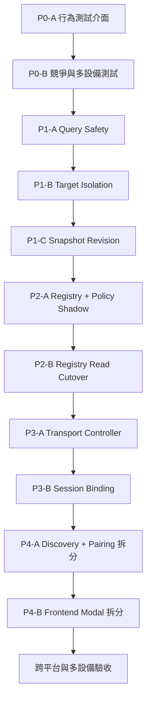

# 設備管理重構實作計畫

> 狀態：In progress
>
> 基準分支：`feat/windows-wireless-direct-spike`
>
> 架構依據：[設備管理架構決策提案](device-management-architecture.zh-TW.md)、[ADR-0001](adr/0001-device-management-registry.md)、[`ARCHITECTURE.md`](../ARCHITECTURE.md#設備管理與傳輸路由)

---

## 實作進度（2026-09-23）

- [x] **P0-A**：加入 `DeviceDiscoveryPort`、immutable `DiscoverySnapshot`、公開 `DeviceManagementService` 與可控制完成順序的 fake。
- [x] **P0-B（第一批）**：加入 query safety、source failure、single-flight、多設備失敗隔離、Direct I/O failure 等回歸案例；revision 競爭案例隨 P1-C 完成。
- [x] **P1-A**：`GET /api/devices` 與 `_scan_devices()` 不再 probe 或關閉 Direct runtime；RSD watcher 關閉時可投影回一般 Wi-Fi，實際 Direct I/O 失敗才清理該設備 runtime。
- [x] **P1-B**：移除跨設備清理；pair／connect／disconnect／remove／clear-address 使用引用計數 keyed lock，同 UDID 序列化、不同設備可並行，auto endpoint 先以 endpoint key 防止重複探測，辨識後進入 UDID lock。
- [x] **P1-C**：加入 `DeviceRevisionLedger`、`GET /api/devices/snapshot`、command revision、同 snapshot 投影、前端 stale revision 拒絕與單一 pending foreground refresh。
- [x] **P2-A**：加入 immutable `DeviceAggregate`、純函式 `route_policy` 與 shadow `DeviceRegistry`；配對、Direct connect／disconnect command 同步旁路狀態，差異與 policy effect 只記錄不執行，HTTP GET 不發布 Registry event。
- [x] **P2-B**：背景 `DeviceDiscoveryCoordinator` 發布 observation；snapshot、`get_device()` 與舊清單改讀 Registry，主動刷新使用獨立 POST command；加入 session pinning event、source failure 保留、D9 未知 tunneld route 過濾並移除 `_system_routes`。
- [x] **P3-A**：加入 `TransportController` 與 `DirectTransportAdapter`；connect／disconnect、USB idle takeover、Direct I/O failure、配對移除及 shutdown cleanup 全部通過 Controller，以 `(udid, revision, effect_type)` 去重並拒絕 stale effect。Discovery／GET／Policy 不持有破壞性能力。
- [x] **P3-B**：`DeviceSession` 固定保存 `bound_route` 與 transport identity，session start／stop／failure 發布 Registry event；route-specific Lockdown／RSD 查詢禁止 active session 靜默換線，舊 handle 的晚到錯誤不能清理新 runtime，部分建立失敗會完整釋放 DVT context。以 runtime injection 移除 `device_manager ↔ device_session` 循環依賴，並移除 `DEVICE_REGISTRY_READS` 雙模式開關。

目前驗證基線：後端 116 項測試全綠；前端 107 項測試與 TypeScript 型別檢查全綠。P3-B 的 macOS x64 local build、Electron 啟動 smoke test 與 ad-hoc 簽章驗證皆通過。測試安裝檔為 `frontend/release/ArcWayfarer-0.1.16-x64.dmg`（218 MB；SHA-256：`f36a7383a5650593e8149a59965b969001cc2f65d0d58eaaaeb5591a8ec7c892`）。

---

## 1. 執行原則

1. 每個 PR 必須可獨立建置、測試、回退；不合併紅燈測試。
2. 先固定外部行為，再替換內部狀態；不得先大拆檔案。
3. 新舊路徑並存時只允許一方寫入，另一方只能 shadow 計算與比對。
4. 所有狀態與 command 以 UDID 隔離；禁止全域批次清理其他設備。
5. 查詢與 discovery 不得建立、切換或關閉 transport。
6. 每個 PR 都要附上對應 D1～D10 的驗證證據。
7. macOS 本機測試通過後才能交付 Windows 實機驗證；Windows 結果不得用 macOS 推定。

### 分支與合併策略

- 每個 PR 從最新 `feat/windows-wireless-direct-spike` 建立短分支。
- 命名：`refactor/device-management-p0a-contract-harness`、`...-p1a-query-safety`。
- 每個 PR 合回測試分支後立即建立 local macOS x64 build；涉及跨平台 adapter 時另產 Windows build。
- P4 與 Windows 多機驗收完成前，不合回 `main`。

---

## 2. PR 路線總覽



| PR | 目的 | 風險 | 預期規模 |
|---|---|---:|---:|
| P0-A | 建立不依賴私有全域的測試介面 | 低 | S |
| P0-B | 固定競爭、多設備與 session 行為 | 低 | M |
| P1-A | 讓查詢與掃描不再破壞 transport | 中 | M |
| P1-B | 移除跨設備清理，加入 per-device operation lock | 中 | M |
| P1-C | 新 snapshot API、revision 與前端 refresh 排隊 | 中 | M |
| P2-A | Registry／Policy shadow mode | 中 | L |
| P2-B | 將讀取與 selected route 切到 Registry | 高 | L |
| P3-A | 收斂 tunnel lifecycle 到 Controller | 高 | L |
| P3-B | Session 綁定 route、移除循環依賴 | 高 | L |
| P4-A | 拆 discovery／pairing adapters，移除舊全域 | 中 | L |
| P4-B | 拆 DeviceManagerModal 並補元件測試 | 中 | M |

---

## 3. P0：合約與測試安全網

### P0-A：建立公開行為測試介面

**目的：** 讓測試透過 service/API 行為驗證結果，不再 patch `_direct_*` 等私有全域。

**新增：**

- `backend/core/device_ports.py`
  - 定義 USB discovery、tunnel discovery、Direct transport、pairing store、session status 的 Protocol。
- `backend/tests/fakes/device_ports.py`
  - 可控制完成順序、失敗與多設備結果的 fake adapters。
- `backend/tests/integration/test_device_management_contract.py`
  - 從公開 service 或 FastAPI endpoint 驗證 DeviceInfo／command 結果。

**限制：**

- Production 仍走 legacy adapter。
- 不在這個 PR 改 route priority 或關閉行為。
- 既有私有測試先保留，待新測試覆蓋相同行為後逐批刪除。

**驗收：**

- PR 開始時記錄後端與前端完整測試 baseline；合併時原有案例與新增案例全部通過，測試數不得減少。
- 新測試不引用 `_direct_addresses`、`_direct_rsd_tunnels`、`_system_routes`。
- Fake 能模擬 scan 在 connect 前開始、connect 後才完成。

### P0-B：建立關鍵行為矩陣

**必要案例：**

1. A 導航中，B 掃描／連線／失敗，A 的 session 與 route 不變。
2. Direct session 執行中插入 USB，仍使用原 `bound_route`。
3. 未顯式啟用 Direct 時，拔 USB／關 Wi-Fi 不得自動進入 Direct。
4. 顯式 Direct 成功後，同時發現系統 Wi-Fi 不得覆蓋。
5. Discovery source failure 不得當成成功空結果。
6. iOS 16 Direct probe 暫時 timeout 不得由 GET 關閉 runtime。
7. 舊 scan 在新 command 後完成，不得覆蓋較新的狀態。

**CI 規則：**

- P0 不直接合併會失敗的測試。
- 每個已知缺陷先在修正分支確認測試對父 commit 會失敗，再與最小修正一同合併；PR 說明需附紅／綠證據。
- 已有正確行為的案例可先獨立合併。

---

## 4. P1：止血與一致性

### P1-A：Query Safety

**修改：**

- `_scan_devices()` 改為產生 observation，不呼叫 `_clear_direct_runtime()`。
- `GET /api/devices`、`get_device()` 不得關閉或替換 transport。
- iOS 16 active Direct 不在每次清單輪詢中以 `_describe_direct()` 做破壞性驗證。
- Active Direct 健康只由 tunnel lifecycle 或實際定位 I/O 回報。

**過渡策略：**

- 舊 manager 尚未拆分時，先回傳 `DiscoverySnapshot` value object。
- P1 階段的 `GET /api/devices` 只投影當次 observation；session idle 時可依既有規格選擇 USB，但不得順便關閉仍健康的 Direct runtime。
- P2 起由獨立 discovery coordinator 發布 observation event 給 Registry；Registry 套用 event 並執行純函式 Policy。P2 shadow mode 只記錄預期的 `USB_TAKEOVER` effect，不執行它；P3 Controller 接管後才允許消費 effect。HTTP GET 只讀 Registry snapshot，不觸發這條 event chain。

**驗收：** D4、D5、D7、D8 全部有公開行為測試。

### P1-B：Target Isolation 與 operation serialization

**修改：**

- 刪除 auto 連線失敗後遍歷 `_direct_rsd_tunnels` 的清理。
- 每次 connect 建立 operation-local 暫存資源，失敗只釋放本 operation 建立的資源。
- 建立具引用計數與清理機制的 `KeyedAsyncLock`，以 normalized UDID 提供 per-device command lock，避免永久累積 lock。
- Auto endpoint 尚未辨識 UDID 時使用 endpoint-scoped lock；辨識後先釋放 endpoint lock，再取得目標 UDID lock並重新驗證端點，避免巢狀鎖與 deadlock。
- 同一設備 connect／disconnect／pair 序列化，不同設備仍可並行。

**驗收：**

- B 失敗前後，A 的 aggregate snapshot、session 與 tunnel identity 完全相同。
- 同一 UDID 的兩個 connect 不會建立兩條 runtime。
- 不同 UDID 的 connect 不會被全域鎖串行阻塞。

### P1-C：Snapshot Revision 與前端刷新

**新增 API：**

```text
GET /api/devices/snapshot
→ {
    snapshot_revision,
    sources: { usb, system_wifi, direct_endpoints },
    devices: [{ ..., revision, selected_route }]
  }
```

舊 `GET /api/devices` 暫時保留，由同一份 snapshot 投影成陣列。

**Revision 過渡實作：**

- 在 Registry 正式接管前先建立單一職責的 `DeviceRevisionLedger`；scan 開始時捕捉 snapshot revision，command 成功時遞增目標設備與全域 revision。
- P2 的 `DeviceRegistry` 直接組合這個 ledger，不再建立第二套 counter，避免 P1 產生一次性狀態機制。
- Scan 回應使用開始觀測時的 revision；因此 connect 期間晚到的舊 scan 仍帶舊 revision，前端可確定丟棄。

**前端：**

- `useDevices` 改用 snapshot endpoint。
- 保存目前最高 `snapshot_revision` 與每個 UDID 的 revision。
- 舊回應不得覆蓋較新 command result。
- foreground refresh 遇到 in-flight scan 時設定 `pendingForegroundRefresh`；舊請求完成後補跑一次。
- background scan 仍維持 single flight，不累積排隊。

**驗收：**

- Direct connect 成功時，即使舊 scan 最後才完成，Badge 與實際 route 仍是 Direct。
- 切換 `includeWifi`、視窗恢復與 20 秒輪詢不會重複無限掃描。
- 新舊 API 在相同 snapshot 上輸出相同設備集合。

---

## 5. P2：Registry 與 Route Policy

### P2-A：Shadow Registry

**新增：**

- `backend/core/device_registry.py`
- `backend/core/device_aggregate.py`
- `backend/core/route_policy.py`

**DeviceAggregate：**

- USB／system Wi-Fi availability
- Direct endpoint candidates
- Direct runtime lifecycle
- authorization
- user intent
- selected route
- session state + bound route
- per-device revision

**Shadow 規則：**

- Legacy manager 仍是唯一 production writer。
- 每次 legacy 狀態變更同時送 event 給 registry 計算預期結果。
- Registry 不操作 tunnel、不回應 production API。
- 僅記錄 legacy output 與 policy output 的差異，不自動修正。
- Shadow event processor 與 HTTP GET 分離；即使 GET 高頻輪詢，也不能增加 event、revision 或 effect 次數。

**驗收：**

- route policy table tests 覆蓋所有主要組合。
- 無差異案例達到既有 USB、Wi-Fi、Direct 正常流程。
- 差異必須分類成 legacy bug、policy bug 或尚未定義規格。

### P2-B：Read Cutover

**切換順序：**

1. `/api/devices/snapshot` 從 Registry 讀取。
2. `get_device()` 從 Registry 取得 selected route。
3. 舊 `/api/devices` 從 Registry snapshot 投影。
4. 移除 `_system_routes` 與重複 route 推論。

**回退：** P2 期間曾使用 `DEVICE_REGISTRY_READS=legacy|registry` 作為短期回退；P3 完成後已依約移除，後續回退以 commit 為單位，不恢復永久雙模式。

**驗收：**

- 對外設備集合與 P1 基線一致。
- D1～D3、D8～D10 全綠。
- 連續 100 次不同完成順序的 deterministic concurrency test 結果一致。

---

## 6. P3：Transport 與 Session 所有權

### P3-A：TransportController

**新增：** `backend/core/transport_controller.py`

Controller 是唯一允許發起下列破壞性操作的 command boundary；adapter 只執行底層 tunnel open／close，不包含 route policy：

- connect Direct
- disconnect Direct
- USB idle takeover
- transport failure cleanup
- application shutdown cleanup

Discovery、GET handler、route policy 不得引用 tunnel 的 `close/aclose`。

**Effect 來源：**

- 使用者 command：connect／disconnect Direct。
- Registry policy effect：session idle 且 policy 的 `selected_route` 轉為 USB 時的 USB takeover；可由 USB availability event 或 session active → idle event 觸發，同一 revision 只執行一次。
- Session I/O event：transport 已確認失敗後的 cleanup。
- Application lifecycle：shutdown cleanup。

Discovery scanner 只發布 observation；Policy 只回傳 effect 描述；Controller 以 `(udid, revision, effect_type)` 去重後執行。GET 不發布 observation、不呼叫 Policy effect，也不直接呼叫 Controller。

**驗收：** repository search 顯示 tunnel open／close 只存在 adapter 與 controller；D4、D6、D7 全綠。

### P3-B：Session Binding

**修改：**

- `DeviceSession` 保存 `bound_route` 與建立它的 transport handle identity。
- Session start／stop／failure 以 event 更新 Registry。
- 插入 USB 不移動 active session。
- Transport 實際失敗時先將 session 標為 failed，再由 Controller 清理並重新計算 route。
- USB 或系統 Wi-Fi 的 `bound_route` 實際失敗後可依 policy 建立新的 USB／Wi-Fi session；不得僅因存在配對紀錄而自動改走 Direct。
- 移除 `device_manager ↔ device_session` 循環 import。

**驗收：**

- 導航、瞬移、搖桿、路線循環、多點、隨機漫步全部通過 session pinning 測試。
- USB／Wi-Fi／Direct 各自失敗時不誤報「已還原定位」。
- Session 結束後 USB takeover 只發生一次。

**完成證據（2026-09-23）：**

- `DeviceSessionStore.pop(expected=...)` 保證舊 handle 的晚到錯誤不能移除新 session；Direct cleanup 只作用於仍為 current 的失敗 session。
- `get_lockdown()`／`get_rsd()` 接受明確 route，Wi-Fi session 不會選到 Direct runtime，Direct session 也不會退回 tunneld。
- 所有定位模式仍共用 `device_session.set_location()`，因此使用相同的 session binding；USB、Wi-Fi、Direct 失敗與 restore 行為由後端完整測試覆蓋。
- Registry 的 active → idle policy effect 與 Controller revision 去重測試確認 USB takeover 每一 revision 最多執行一次。
- Production 啟動後固定由 Registry 提供 public read model；舊 service 僅保留為 P4 前的 discovery adapter 與未啟動 coordinator 的測試 seam。

---

## 7. P4：模組與 UI 拆分

### P4-A：後端 adapters

**目標檔案：**

```text
backend/core/discovery/usb_scanner.py
backend/core/discovery/system_wifi_scanner.py
backend/core/discovery/direct_endpoint_scanner.py
backend/core/transport/usb_adapter.py
backend/core/transport/system_wifi_adapter.py
backend/core/transport/direct_tcp_adapter.py
backend/core/transport/direct_rsd_adapter.py
backend/core/pairing_manager.py
```

完成後移除舊的 9 個模組級狀態與 `device_manager.py` 中已被接管的責任。可保留薄 facade 維持 import compatibility，但 facade 不保存狀態。

### P4-B：前端 Device Manager

**拆分：**

```text
DeviceManagerModal.tsx          # modal shell / routing
DeviceListView.tsx              # 即時設備清單
WirelessDirectView.tsx          # endpoint discovery
DirectConnectionFlow.tsx        # loading / error / retry
QuickReconnectList.tsx          # 最近兩筆歷史
useDeviceManagerController.ts   # command + revision orchestration
```

**元件測試：**

- Direct 成功後 Badge 與按鈕狀態。
- 舊 snapshot 被忽略。
- 快速復連最多兩筆且同 UDID 更新不重複。
- 連線失敗回到端點清單且不修改其他設備。
- 掃描失敗保留最後成功 snapshot 並顯示 stale diagnostic。

---

## 8. 最終驗收矩陣

| 類別 | 必測場景 |
|---|---|
| 單設備 route | USB only、Wi-Fi only、Direct only、USB+Wi-Fi、Wi-Fi+Direct、三者同時 |
| Session pinning | Direct 導航中插 USB、Wi-Fi 導航中 Direct 掃描、USB 導航中拔線 |
| 網路切換 | DHCP 換 IP、mDNS 消失、Wi-Fi 暫斷後恢復、舊 IP 被另一台手機取得 |
| 多設備隔離 | A 導航，B connect 成功／失敗／取消；B 清除歷史不得影響 A |
| 掃描一致性 | source timeout、成功空結果、舊 scan 晚到、foreground refresh 排隊 |
| 授權 | paired、stale、USB refresh、移除授權、歷史紀錄不等於在線 |
| 平台 | macOS x64、macOS arm64、Windows x64 |
| iOS | iOS 16 Direct TCP、iOS 17+ RemotePairing/RSD |
| UI | 清單只顯示在線設備、唯一 Badge、快速復連兩筆、3 席容量 |

### Release gate

全部條件滿足後才能把重構合回 `main`：

1. 後端、前端 unit／integration／component tests 全綠。
2. macOS x64 與 arm64 local build 啟動及簽章檢查通過。
3. Windows x64 原生 build 成功。
4. 至少一台 iOS 16 與一台 iOS 17+ 完成設定、定位、導航、停止並還原。
5. Windows 完成 USB、一般 Wi-Fi、Wireless Direct 與換網重連實測。
6. 兩台設備隔離情境通過；三席 UI 顯示與容量行為正確。
7. Repository search 確認 discovery／GET 不含 transport close。
8. 舊全域與 feature flag 已移除，文件與實作一致。

---

## 9. 執行順序與停損點

第一個實作批次固定為 **P0-A → P0-B → P1-A**。完成 P1-A 後先建立 local build，重測目前已知的 USB、一般 Wi-Fi、Direct、換網與多設備情境，再決定是否進 P1-B。

任何階段出現以下情況立即停止推進：

- Active session 被 scan 或其他設備操作中斷。
- 同一 UDID 出現兩個 selected route 或兩張即時卡片。
- Query 造成 tunnel close。
- Registry 與 legacy output 差異無法由既有契約判定。
- Windows 原生環境出現 macOS 測試未覆蓋的 transport 語意。

停損後只在當前 PR 修正或回退，不把不確定行為帶入下一階段。
